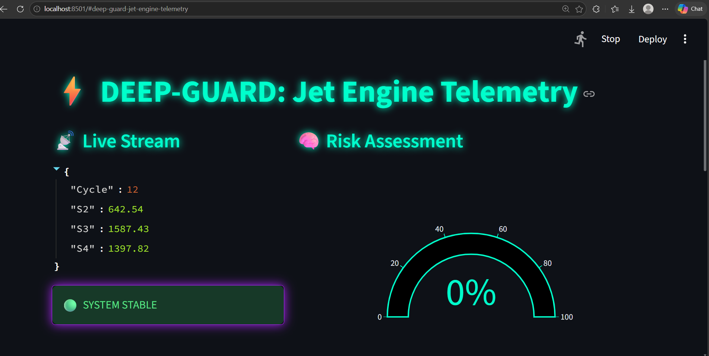
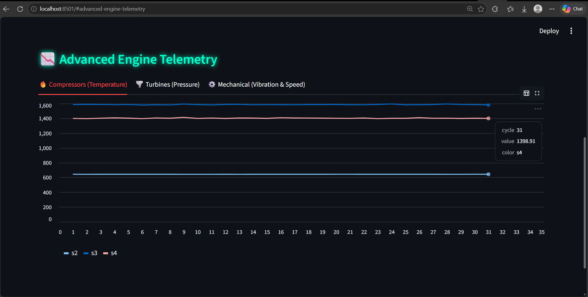
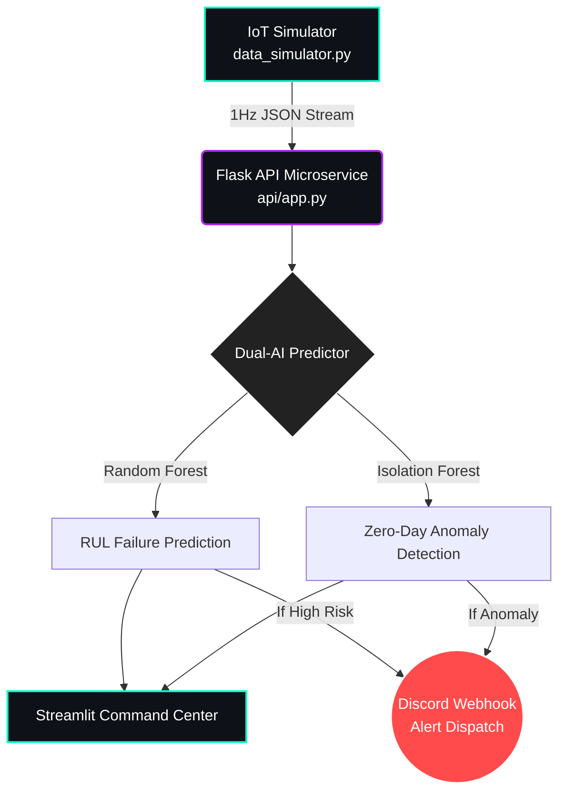

# ⚡ DeepGuard AI: Predictive Maintenance & Telemetry Engine


**DeepGuard** is an industry-grade, microservice-based AI pipeline designed to ingest real-time IoT sensor data, predict critical mechanical failures before they occur, and dispatch automated alerts. 

Built using the **NASA CMAPSS (Turbofan Engine Degradation)** dataset, this system transitions beyond basic binary classification by utilizing a dual-model ensemble to calculate Remaining Useful Life (RUL) and detect zero-day mechanical anomalies.

---

## 📸 Command Center Dashboard

*(Real-time probability tracking and automated dispatch status)*


*(Live multidimensional sensor degradation tracking)*


---

## 🚀 Core Architecture Flow

This project is structured as a distributed microservice architecture, simulating a true enterprise production environment. The system diagram below illustrates the real-time data flow:


### 📂 Project Structure
``` text
AI-Predictive-Maintenance-IoT/
│
├── data/                   # NASA CMAPSS Dataset
├── models/                 # Serialized joblib assets (.pkl)
├── logs/                   # System and prediction logging
├── images/                 # Architecture and UI screenshots
│
├── src/
│   ├── preprocess.py       # Data cleaning and pipeline orchestration
│   ├── feature_engineering.py # RUL calculation and label generation
│   ├── model_train.py      # Dual-model training and scaling pipeline
│   ├── predictor.py        # Inference engine
│   ├── anomaly.py          # Isolation Forest handler
│   ├── alert_system.py     # Webhook dispatcher
│   ├── data_simulator.py   # IoT data stream generator
│   └── logger.py           # CSV system telemetry logging
│
├── api/
│   └── app.py              # Flask Microservice (Port 5000)
│
├── dashboard/
│   └── streamlit_app.py    # Live Streamlit UI (Port 8501)

```
### 🛠️ Quick Start & Execution
1. Install Dependencies

Bash
pip install pandas numpy scikit-learn flask streamlit plotly requests

2. Train the Pipeline
Ingest the NASA data, engineer the RUL features, and generate the models:

Bash
python src/model_train.py

3. Boot the Prediction API
Start the backend server to listen for incoming sensor telemetry:

Bash
python api/app.py

4. Launch the Live Dashboard
Open a new terminal and initialize the frontend visualizer:

Bash
streamlit run dashboard/streamlit_app.py


### 📊 Dataset Context

This system utilizes the widely recognized NASA CMAPSS (Commercial Modular Aero-Propulsion System Simulation) dataset. Rather than simple, synthetic "pass/fail" data, this involves run-to-failure trajectories. The models must identify subtle, multidimensional drift across 14 active sensors to predict the Remaining Useful Life (RUL) of the asset.

### Developer
Developed by Shravani Mane | Computer Science & Engineering (AIML)    